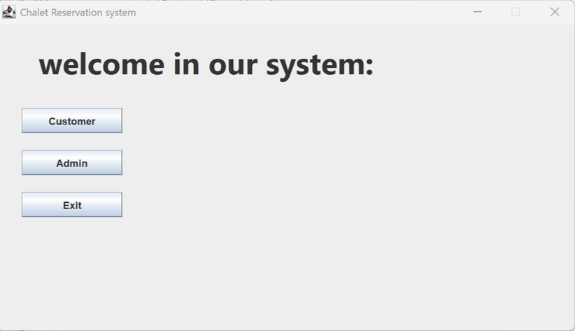
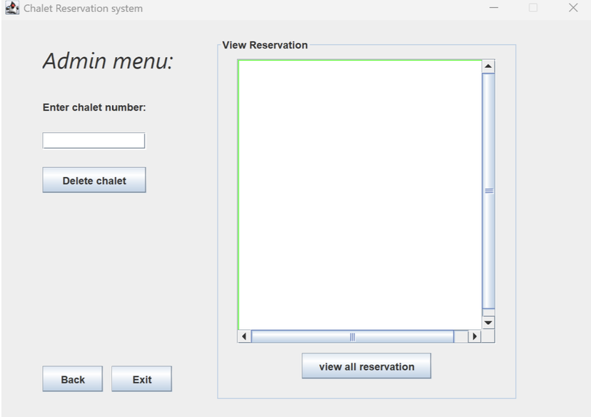
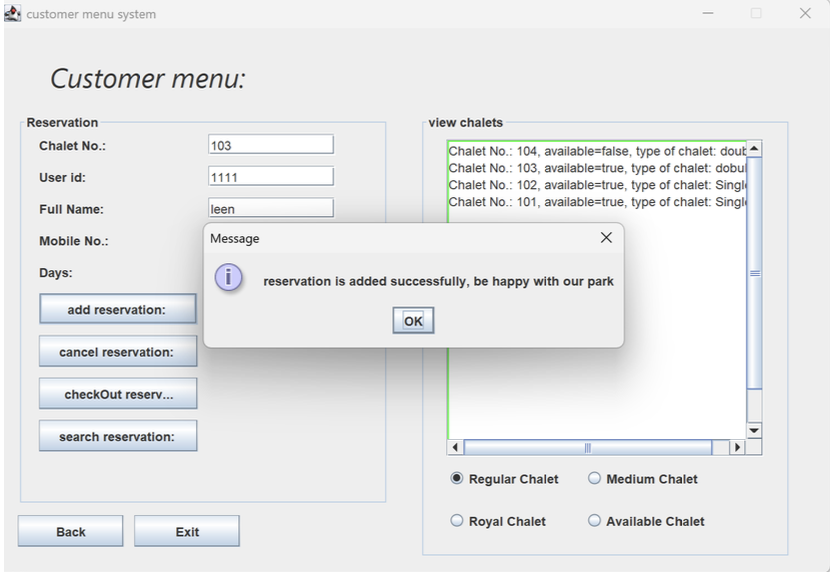
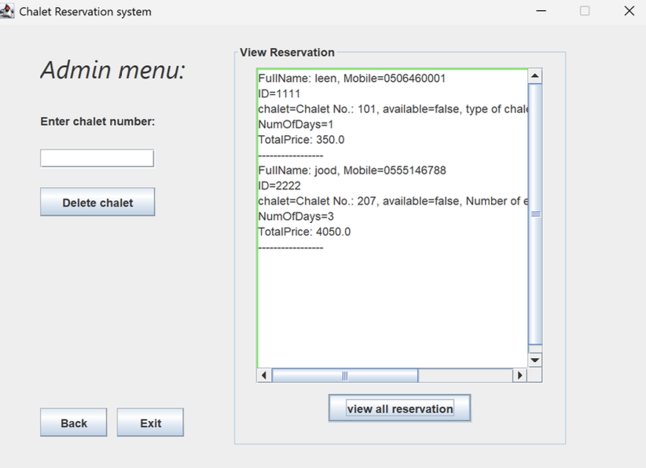
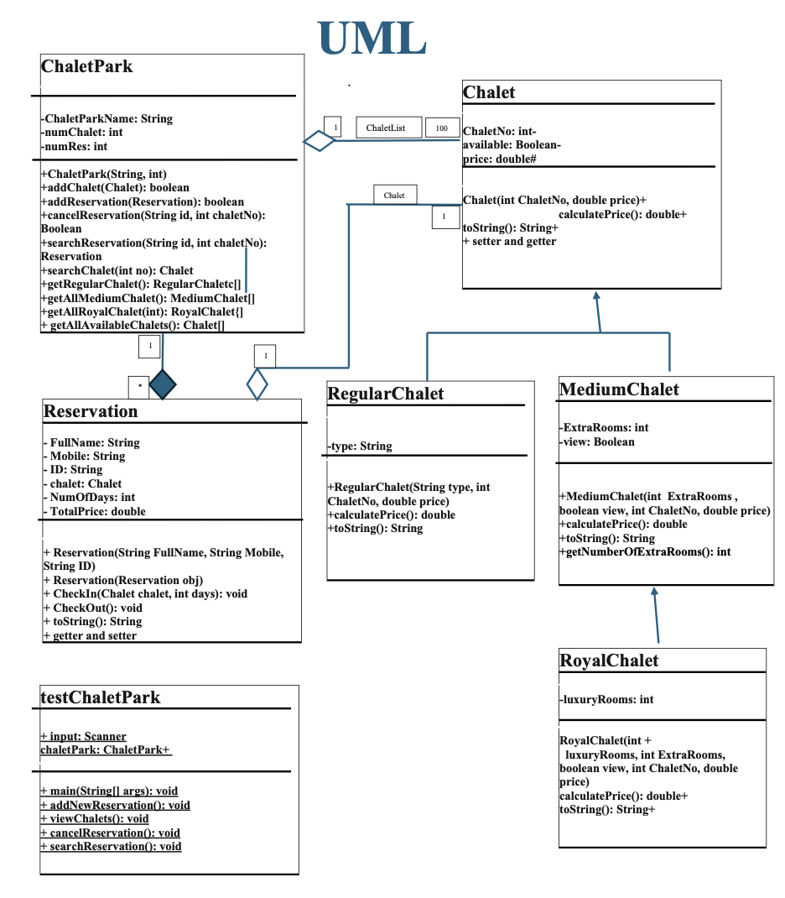

# chalet reservation system

a java gui-based reservation system designed using object-oriented programming principles and file-based data persistence.

---

## project overview

this project simulates a chalet park reservation system with a graphical user interface that allows users to manage bookings efficiently.

it supports browsing chalets, making and canceling reservations, checking out, and searching for existing bookings.

this project was developed as an upgrade from a console-based application into a fully gui-driven java application.

---

## technologies & concepts

- java  
- java swing (gui)  
- object-oriented programming (inheritance, polymorphism, composition)  
- custom linked list implementation  
- file i/o using object serialization  
- exception handling (including custom exceptions)  

---

## features

- gui-based user interaction  
- multiple chalet types:
  - regular chalet  
  - medium chalet  
  - royal chalet  
- add, cancel, and search reservations  
- check-out functionality  
- filter chalets by availability and type  
- persistent data storage using `.dat` files  
- input validation using custom exceptions  

---

## application structure

- chalet (abstract class)  
- regularchalet, mediumchalet, royalchalet  
- reservation  
- chaletpark (system manager)  
- node (linked list implementation)  
- gui frames:
  - firstframe  
  - adminframe  
  - customerframe  

---

## 🖥️ system walkthrough (gui)

### home page

### admin dashboard

### add reservation

### view reservations

---

## uml diagram

---

## data persistence

- chalet data is stored in `chalets.dat`  
- reservation data is stored in `reservations.dat`  
- data is automatically loaded when the application starts  

---

## how to run

1. open the project in any java-supported ide (intellij, eclipse, or netbeans)  
2. compile the project  
3. run `testchaletpark.java`  
4. the gui will launch automatically  
